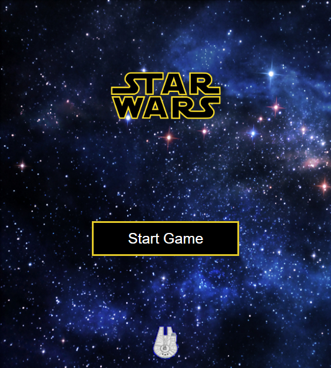
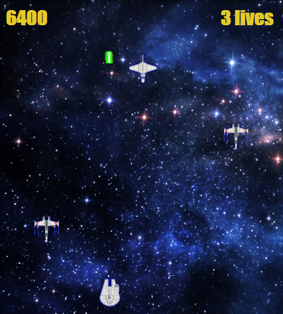
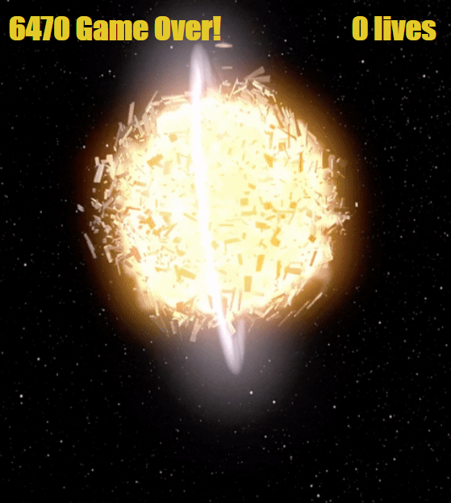

# Star Wars Minigame

Simple Star wars game in Javascript, HTML and CSS. The goal of the game is to shoot all the enemies. The player has 3 lives and the ability to fire bullets.

## Tech Stack

- Javascript
- HTML
- CSS

## RUN LOCALLY

```
git clone https://github.com/Charles9869/Star-Wars-Minigame.git
```

## SCREENSHOTS






